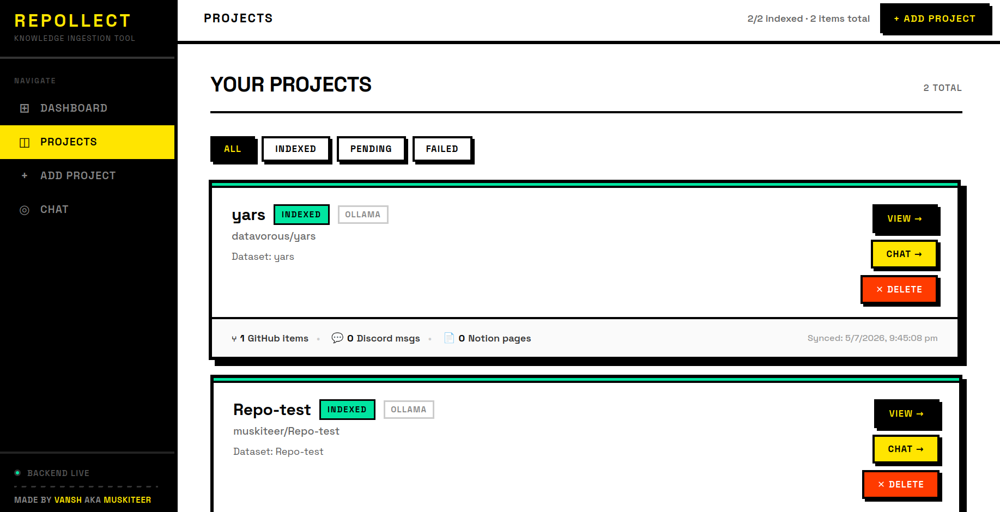
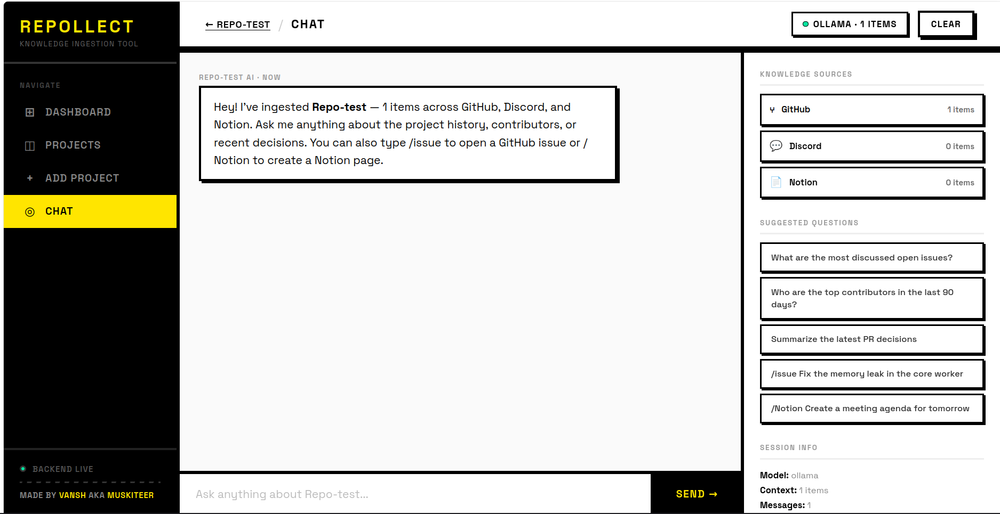
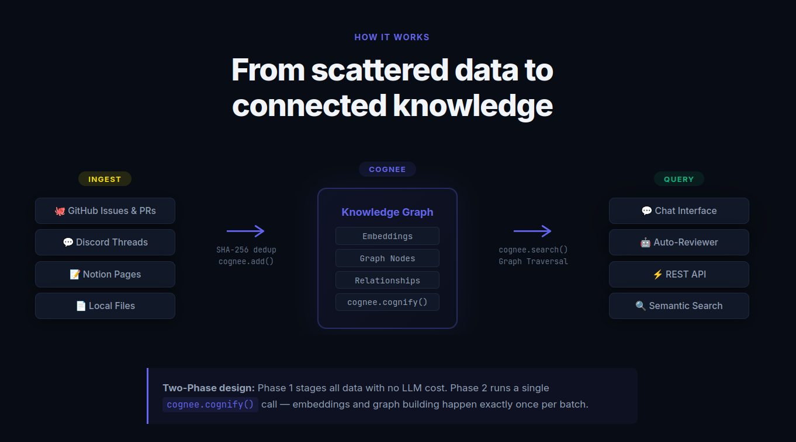

# RepoCollect

> Built with ❤️ for the **WeMakeDevs × Cognee Hackathon** — Jun 29 – Jul 5, 2026

**🎥 [Watch the Live Demo Video Here](#)**  
*(Replace `#` with your YouTube or Loom link before submission)*

## 📑 Table of Contents
1. [The Problem](#-the-problem)
2. [How We Used Cognee](#-how-we-used-cognee)
3. [Capabilities](#-capabilities)
4. [Architecture](#-architecture)
5. [Repository Structure](#-repository-structure)
6. [Getting Started](#-getting-started)
7. [API Keys](#-how-to-get-api-keys)
8. [Roadmap](#-future-upgrades--roadmap)
9. [Contributing & License](#-contributing)

---
RepoCollect
## 🚨 The Problem

When a new hire joins an open-source project or engineering team, they are immediately hit with the "Where's my context?" problem. Codebases are massive, decisions are scattered across closed GitHub issues, old Discord threads, and buried Notion documents. Traditional onboarding involves weeks of tapping senior engineers on the shoulder just to figure out *why* a piece of code exists.

RepoCollect solves this by ingesting a project's entire scattered history into a unified organizational memory. It acts as an AI copilot that instantly retrieves the exact context across all platforms to give accurate, informed answers to any new contributor.

---

## 🧠 How We Used Cognee

Because codebases and team communications are inherently relational, standard vector-only Retrieval-Augmented Generation (RAG) fails to connect the dots. 

We built RepoCollect on **Cognee's hybrid graph-vector store**. When we ingest data, Cognee doesn't just create vector embeddings; it builds a knowledge graph where every issue, pull request, Discord message, and Notion page is a node. This allows RepoCollect to understand that *"PR #482 fixed a bug in the auth-service, which was discussed by Alice in #incident-channel, and decided upon in a Notion meeting."* By tracing these edges, we inject perfect, hallucination-free context into the LLM prompt.

---

<!-- 📸 Add your Main Page / Dashboard screenshot below -->


## ✨ Capabilities

### Two-Phase Ingestion Pipeline
1. **Stage** — Fetch data concurrently from GitHub, Discord, Notion, and local files. Deduplicate by SHA-256 content hash, and buffer via `cognee.add()`. No LLM calls, no embedding costs.
2. **Cognify** — A single `cognee.cognify()` pass processes the entire buffer: generates embeddings, extracts entities, and builds the knowledge graph.

### Incremental Synchronization
Tracks `last_synced_at` per project. Subsequent syncs only pull data newer than the last timestamp — lightning-fast background jobs that keep the graph fresh without re-processing everything.

### Smart Chat Interface
Context-aware chat with grounded LLM responses and specialized slash commands:

<!-- 📸 Add your Chat Interface screenshot or GIF below -->


| Command | Description |
|---------|-------------|
| `/issue <title>` | Create a GitHub Issue from chat |
| `/notion <title>` | Create a Notion page |
| `iss{N} <question>` | Fetch and discuss a specific Issue *(No slash needed for lightning-fast lookups)* |
| `pr{N} <question>` | Fetch and discuss a Pull Request *(No slash needed)* |
| `diff{N}` | AI-powered explanation of a PR's code changes |
| `/contributors` | List all contributors with commit counts |
| `@username` | Get a contributor's activity summary |

### Auto-Review Scheduler
A background worker that continuously polls GitHub for new Issues and PRs, queries the knowledge graph for historical context, generates an AI review, and posts it automatically as a GitHub comment.

### REST API & Project Management
Full API under `/api/v1` for project CRUD, ingestion/sync triggers, and chat. Interactive docs at `localhost:8000/docs`. Projects securely store per-platform API tokens (GitHub PAT, Notion, Discord).

---

## 🏗️ Architecture

<!-- 📸 Add your Architecture Diagram below -->


*Data flows from external APIs into the Ingestion Layer, is deduplicated and cognified into the Cognee Graph-Vector store, and is served to users via the Chat Interface and Background Auto-Reviewer.*

---

## 📁 Repository Structure

```text
cognee/
├── app/                        # Python FastAPI Backend
│   ├── api/
│   │   ├── handlers/           # Core business logic (chat, ingest, sync)
│   │   └── routes/             # FastAPI endpoints
│   ├── ingest/                 # Platform-specific data extractors (discord, github, notion)
│   ├── internal/               # Background tasks (scheduler.py)
│   ├── tool/                   # Chat-invoked live API tools (fetch_issue, fetch_diff, comment)
│   ├── utils/                  # Cognee GraphRAG utilities
│   ├── db.py                   # SQLite database initialization
│   └── main.py                 # Application entry point
│
└── ui/                         # React Frontend (Vite + TypeScript)
    └── src/
        ├── AddProject.tsx      # Project creation UI
        ├── BrowseProjects.tsx  # Project list and sync dashboard
        └── ChatView.tsx        # LLM interface with slash commands
```

---

## 🚀 Getting Started

### 1. Clone & Install
```bash
git clone <your-repo-url>
cd cognee

# Backend setup
cd app
python3 -m venv venv
source venv/bin/activate
pip install -r requirements.txt

# Frontend setup
cd ../ui
npm install
```

### 2. Environment Variables (`app/.env`)
Create a `.env` file in the `app/` directory:

```env
# LLM & Embeddings (Ollama local fallback)
LLM_PROVIDER="ollama"
LLM_MODEL="qwen2.5:7b"
LLM_ENDPOINT="http://localhost:11434/v1"
LLM_API_KEY="ollama"
EMBEDDING_PROVIDER="fastembed"
EMBEDDING_MODEL="sentence-transformers/all-MiniLM-L6-v2"
EMBEDDING_DIMENSIONS="384"

# External APIs
GROQ_API=your_groq_api_key
GITHUB_PAT_TOKEN=your_github_token
NOTION_TOKEN=your_notion_token
DISCORD_BOT_TOKEN=your_discord_token

# Scheduler Config
AUTO_REVIEW=True
REVIEW_TIME_MIN=30
```

### 3. Run the App
**Terminal 1 (Backend):**
```bash
cd app
uvicorn main:app --host 0.0.0.0 --port 8000 --reload
```

**Terminal 2 (Frontend):**
```bash
cd ui
npm run dev
```

---

## 🔑 How to get API Keys

- **Groq API Key:** Go to [Groq Console](https://console.groq.com/) > API Keys.
- **GitHub PAT:** Go to [GitHub Settings](https://github.com/settings/tokens). Select `repo` scope.
- **Notion Token:** Go to [Notion Integrations](https://www.notion.so/my-integrations). *Crucial: Manually share target Notion pages with your integration!*
- **Discord Bot Token:** Go to [Discord Developer Portal](https://discord.com/developers/applications). Enable **Message Content Intent**.

---

## 🔮 Future Upgrades / Roadmap

* **Expanded Integrations:** Native support for Slack, Linear, Jira, and GitLab.
* **Auto-PR for Known Fixes:** Automatically generate a draft PR with a historical fix applied when a new bug matches a known pattern in the graph.
* **Knowledge Gap Detection:** Automatically open GitHub Discussions when users ask questions that have no answer in the knowledge graph.
* **MCP Server Integration:** Expose RepoCollect's slash commands and search directly to IDEs (Cursor, Windsurf) and Claude Desktop.

---

## 🤝 Contributing

Contributions, issues, and feature requests are welcome!  
Feel free to check out the [issues page](#) if you want to contribute. We'd love to see RepoCollect grow to support more integrations.

## 📜 License

This project is licensed under the MIT License.

---

## 💝 Acknowledgments

- **[Cognee](https://cognee.ai)** — The graph-vector hybrid memory that makes RepoCollect's knowledge graph possible.
- **[WeMakeDevs](https://wemakedevs.org)** — For organizing the hackathon and bringing together builders.
- Every open source project whose public history helped shape and test this tool.

> Made with love by [muskiteer](https://github.com/muskiteer) — for every developer who's ever asked "why does this code exist?"